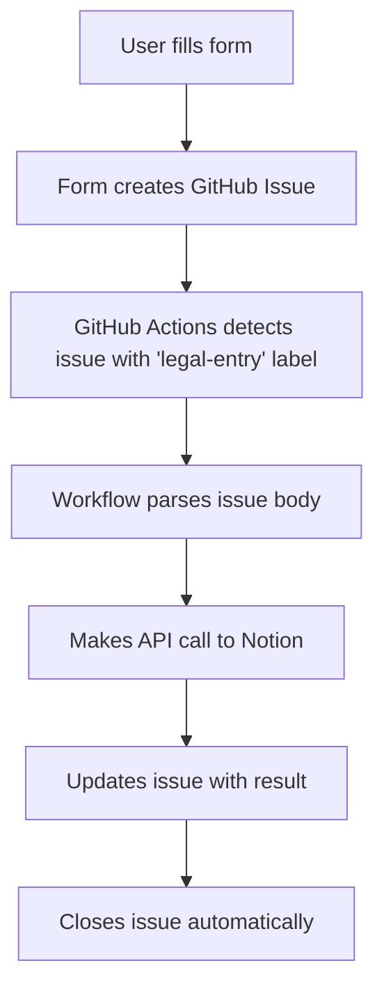

# Zero-Cost GitHub Actions Setup Guide

This guide shows you how to set up the Notion Law Data Collector using only free GitHub services, eliminating all monthly costs.

## What Makes This Zero-Cost?

- ✅ **GitHub Pages**: Free static website hosting
- ✅ **GitHub Actions**: 2,000 free minutes/month for public repos (500 for private)
- ✅ **GitHub Issues**: Unlimited for public repositories
- ✅ **No External Services**: No Vercel, Railway, or other paid platforms needed

## Setup Instructions

### 1. Repository Setup

1. **Fork this repository** to your GitHub account
2. **Enable GitHub Pages**:
   - Go to Settings > Pages
   - Set source to "Deploy from a branch"
   - Select "main" branch and "/ (root)" folder
   - Click Save

### 2. Configure Secrets

1. Go to your repository **Settings > Secrets and variables > Actions**
2. Add these repository secrets:

| Secret Name | Description | Where to Get It |
|-------------|-------------|-----------------|
| `NOTION_TOKEN` | Your Notion integration token | [Notion Integrations](https://www.notion.so/my-integrations) |
| `NOTION_DATABASE_ID` | Your Notion database ID | Copy from database URL |

### 3. Create the Issue Label

1. Go to your repository **Issues > Labels**
2. Click **"New label"**
3. Set:
   - **Name**: `legal-entry`
   - **Description**: `Legal case entry for processing`
   - **Color**: Any color you prefer
4. Click **"Create label"**

### 4. Create Your Notion Database

1. **Create a new page** in Notion
2. **Add a database** with these exact property names:
   - **Title** (Title type)
   - **Case Number** (Rich Text)
   - **Court** (Rich Text)
   - **Judge** (Rich Text)
   - **Date** (Date)
   - **Status** (Select with options: Pending, Active, Closed, Appeal)
   - **Parties** (Rich Text)
   - **Type** (Select with options: Civil, Criminal, Family, Corporate, Constitutional, Administrative)
   - **Summary** (Rich Text)
   - **Outcome** (Rich Text)
   - **Tags** (Multi-select)
   - **Priority** (Select with options: Low, Medium, High, Urgent)

3. **Share with your integration**:
   - Click the **"Share"** button
   - Click **"Invite"**
   - Search for your integration name
   - Give it **"Can edit"** permissions

4. **Copy the database ID** from the URL:
   ```
   https://notion.so/workspace/DATABASE_ID?v=...
   ```
   The database ID is the 32-character string between the workspace name and the `?v=` part.

### 5. Test Your Setup

1. Visit your GitHub Pages URL (found in Settings > Pages)
2. Enter your repository details and database ID
3. Click "Test Configuration"
4. Fill out a test case and submit
5. Check that a GitHub issue was created with the `legal-entry` label
6. Monitor the Actions tab to see the workflow run
7. Check your Notion database for the new entry

## How It Works



1. **Form Submission**: User fills out the web form
2. **GitHub Issue**: Form data creates a GitHub issue with `legal-entry` label
3. **GitHub Actions**: Workflow triggers when issue is created
4. **Data Processing**: Script parses issue body and extracts case data
5. **Notion API**: Makes authenticated API call to create page in Notion
6. **Feedback**: Updates the issue with success/error message
7. **Cleanup**: Automatically closes the issue when successful

## Cost Analysis

### Traditional Setup (With Monthly Costs)
- Vercel Pro: $20/month
- Railway Pro: $5/month
- Render: $7/month

### GitHub Actions Setup (Zero Cost)
- GitHub Pages: **FREE** (unlimited for public repos)
- GitHub Actions: **FREE** (2,000 minutes/month for public repos)
- GitHub Issues: **FREE** (unlimited for public repos)
- **Total**: $0/month

## Monitoring and Troubleshooting

### Check Processing Status
1. **GitHub Issues**: Look for issues with `legal-entry` label
2. **Actions Tab**: Monitor workflow runs for errors
3. **Issue Comments**: Automatic status updates posted to issues

### Common Issues
- **Workflow not running**: Check that `legal-entry` label exists
- **API errors**: Verify Notion token and database ID in secrets
- **Permission errors**: Ensure integration has edit access to database

### GitHub Actions Usage
- Each case submission uses ~1-2 minutes of Actions time
- 2,000 free minutes = ~1,000-2,000 case submissions per month
- For higher volume, consider upgrading to GitHub Pro ($4/month for 3,000 minutes)

## Migration from Existing Setup

If you're migrating from Vercel/Railway/Render:

1. Follow this setup guide
2. Update any bookmarks to point to your GitHub Pages URL
3. Cancel your paid hosting subscriptions
4. Your data and workflow remain the same

The interface and functionality are identical - only the backend processing method changes.

## Security Benefits

- **No API keys exposed**: Tokens stored securely in GitHub secrets
- **Audit trail**: All submissions tracked via GitHub issues
- **Access control**: Repository permissions control who can submit data
- **Transparency**: All processing visible in Actions logs

## Support

- **Issues**: Use GitHub Issues for bug reports
- **Documentation**: Check the main README.md
- **Actions**: Monitor the Actions tab for workflow status